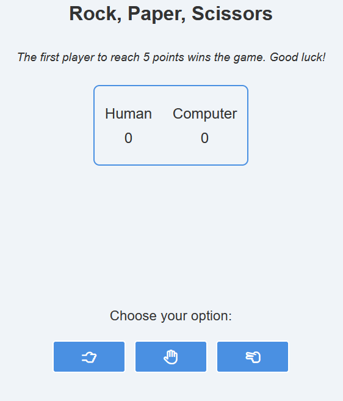
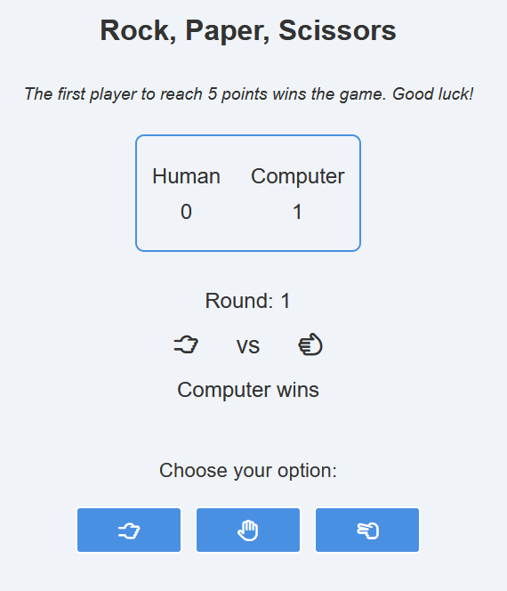
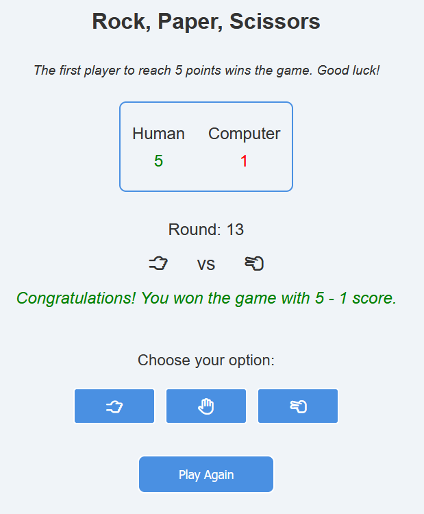

# rock-paper-scissors

> A simple Javascript game
> Live https://abasiadimas.github.io/rock-paper-scissors/

# Screenschots

## Table of Contents

- [General Information](#general-information)
- [Built With](#built-with)
- [Project Status](#project-status)
- [Authors](#authors)
- [Acknowledgements](#acknowledgements)

## General Information

- Rock Paper Scissors is a hand game where two players choose Rock, Paper, or Scissors.
- Rules:
- Rock crushes Scissors, Scissors cuts Paper, and Paper covers Rock.
- If both choose the same, it's a tie.

## Built With

- HTML5
- CSS
- JS

## Project Status

Project is: \_Finished

## Version History

-2.0
Web App Game Version

It is currently possible to play the game via the interactive User Interface.

## Authors

Anastasios Basiadimas

## Acknowledgements

- This project was based on the "The Odin Project" - (https://www.theodinproject.com/)
